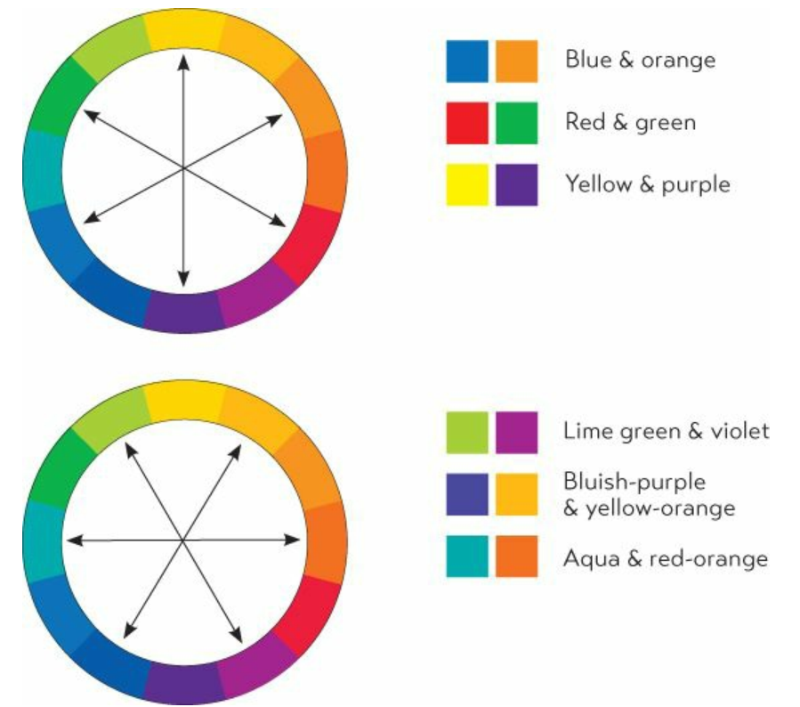

## 1. Complementary
often work best when one is the main and the other is an accent;(contrast??)

  
  

## 2. Triads
**harmonize wll**

### 2.2 Split complement triads
  

### 3. Analogous colors
  
  

## shade and tint
  
  

## How to begin to choose
- season?
- official company?
- logo?
- photography or image?

