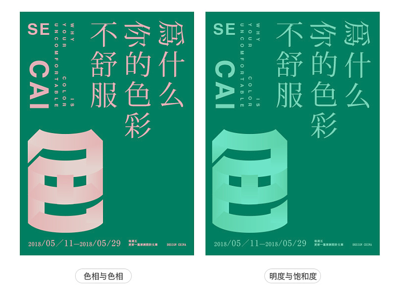
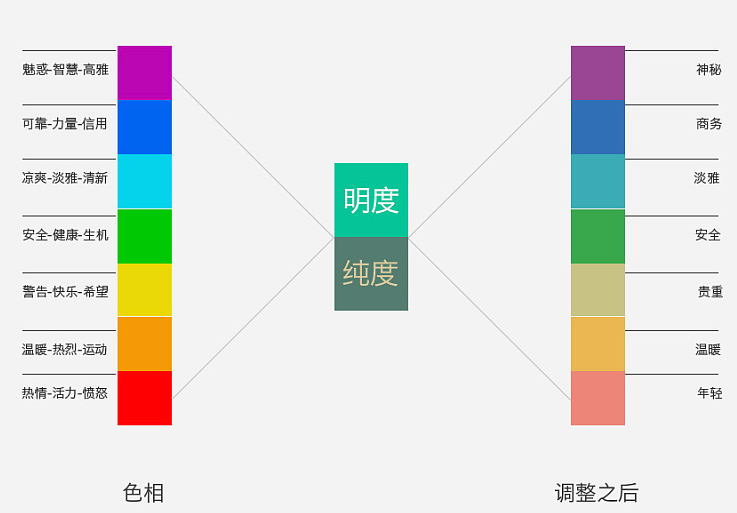
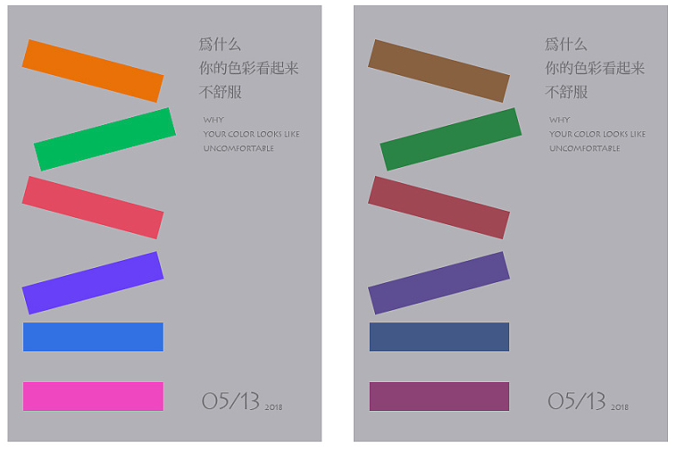
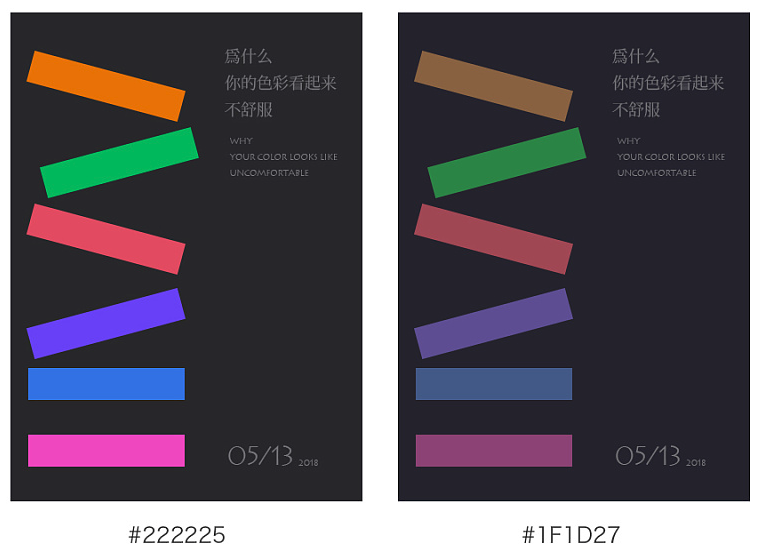
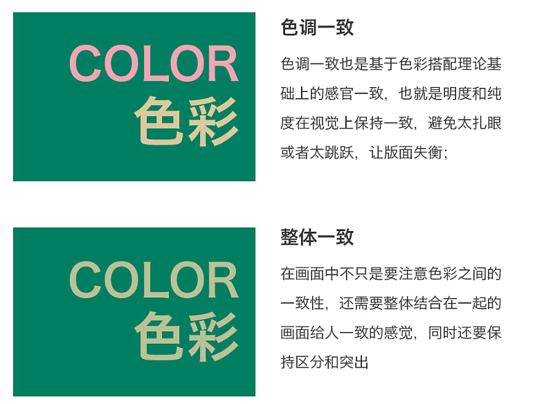
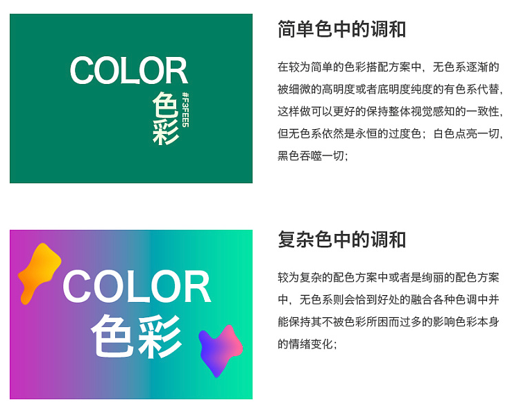
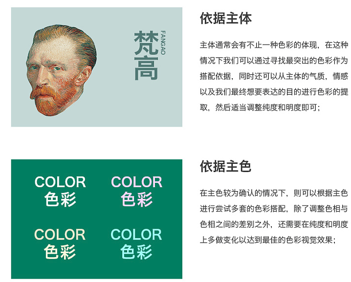
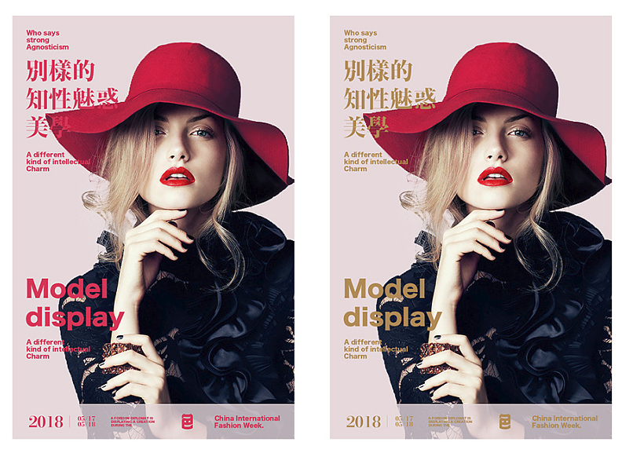

**来源**\
[站酷-为什么你的色彩看起来不舒服](http://www.zcool.com.cn/article/ZNjg0ODU2.html)

#### 色彩三要素（按重要性上升）
1. 色相
3. 饱和度
2. 明暗

#### 分两种情况讨论：
1. 一个画面两种色相：
遵循三原色原理，对一个色相的明度和纯度调整，色彩的搭配就是**确定色相，以色相深浅明暗调整使色彩整体表达**，如果只调整色相则会让画面不堪入目  
重要性：五星  
2. 一个色相：
明度和纯度发挥最大作用。但单一色相会比较局限，难以满足多种情绪的细微表达。与左图相比，整个画面显得亮一些

#### 理论认知与感性认知
  
  
  

#### 提升色彩舒适度
1. 一致性
  
2. 无色调和
无色并不是没有色彩。尤其是在大面积使用高饱和度和纯度的画面中或者多色的搭配中，无色可以很好地起到调和色彩和视觉感知平衡的作用。  
  
在画面主题色不变时，只调整文字的颜色对比，显得更为舒服。  
3. 主从原则  
  
  
在主体色的基础上，尝试不同的配色方案。  

---
我自己一直觉得色彩非常重要，也是最难的一部分，决定了整体的感觉，或者说第一印象！
