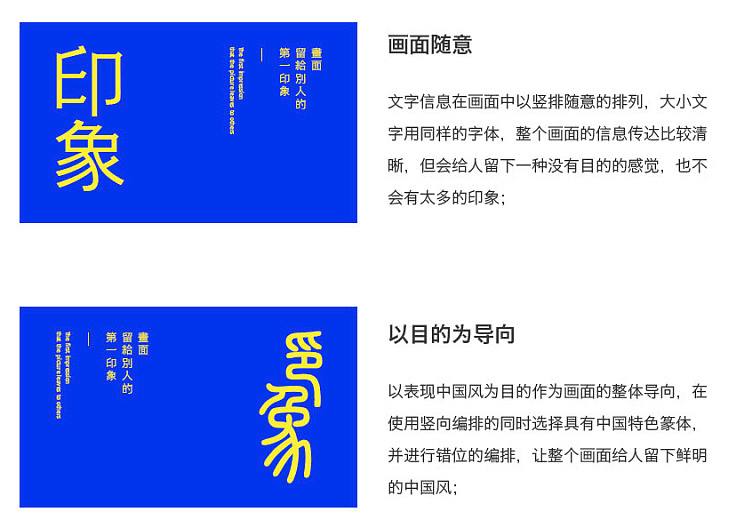
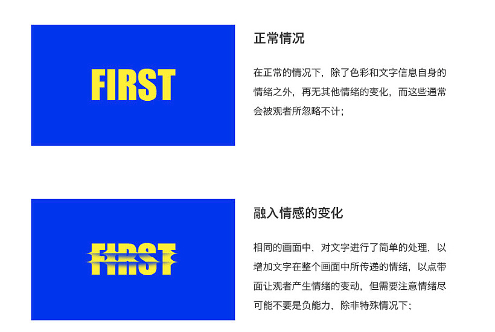
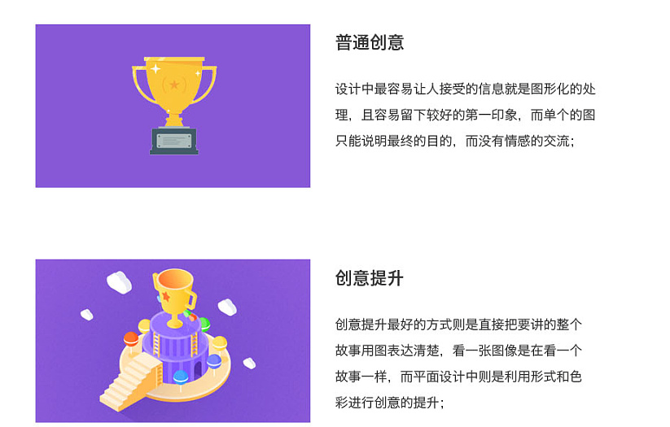

**来源：**
[站酷-设计中画面留给别人的第一印象](http://www.zcool.com.cn/article/ZNjE4NzMy.html)

### 如何把控第一印象
1. 以目的为导向
2. 融入情感情绪
3. 提升创意

#### 以目的为导向
  
画面给人的第一印象要与主题相关  
包括色彩、元素的排布、字体等  

#### 融入情感情绪
  
品牌设计与字体设计  

#### 提升创意
  
流程应该就是这三步了  
