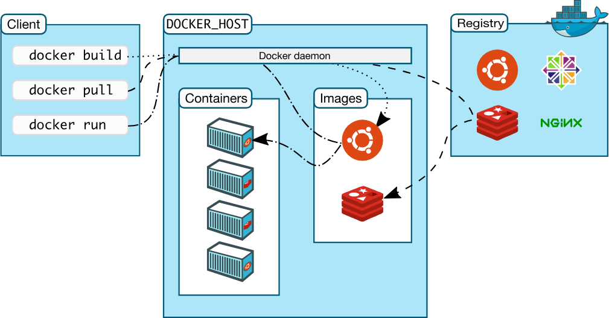

#### some features of Docker
- cross platfoem: Windows(win 10 is better) , Mac or Linux
- same soft-running environment

## objects of Docker
#### virtual machines
- precursors to Docker containers.  
- isolate an application and its dependencies;

#### image
An image contains the Dockerfile, libraries, and code your application needs to run, all bundled together.

#### Dockerfile
 a file with instructions  

 #### container
A Docker image plus the command `docker run image_name` creates and starts a container from an image.

#### container registry
a platform include lots of image. [Docker Hub](https://hub.docker.com/) is the largest registry and the default.

  

## Docker essentials
#### docker platform
Docker’s software that provides the ability to package and run an application in a container on any Linux server.
#### docker engine
the client-server application, includes:  
1.  Docker Community Edition (CE)
2.  Docker Enterprise(commercial)  
- A server which is a type of long-running program called a daemon process (the `dockerd `command).
- A REST API which specifies interfaces that programs can use to talk to the daemon and instruct it what to do
- A command line interface (CLI) client (the `docker` command).  
The CLI uses the Docker REST API to control or interact with the Docker daemon through scripting or direct CLI commands.

**Docker Client**:  
**Docker Daemon**:  
**Docker Volumes**:are the best way to store the persistent data that your apps consume and create  
  

#### Example: save jupyter data
From jupyter docker documentation, it specifies the working diretory of
the container as `/home/jvvyan/`.
```sh
docker run -p 8888:8888 -v curie:/home/jovyan/ brmather/pycurious
```

