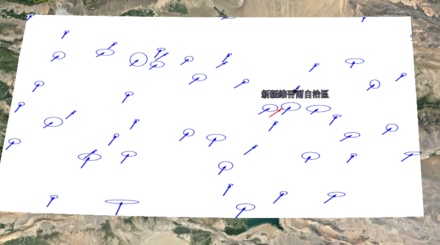

### GMT的终极武器之一！
之前我一直以为PS文件只能转换为jpg、PDF等没有地理坐标的普通图片。  
但是想想怎么可能，花那么多力气绘制了坐标在图上，最后输出时却没有了坐标信息？  
本文主要就是讲怎么把PS图件转换为带坐标的图件（kml和geotiff），这样就可以与其他软件互动，这大大拓宽了GMT的应用范围。  

#### 1. 转换为普通图片格式
> gmt psconvert input.ps -A0.5c -E600 -Tp -V

> 解释：  
> input.ps是待转换的PS图件  
> -A是切除画板（A4页面）上的留白。不带任何参数值是切除所有的留白，0.5c是在四个边框都留出0.5c（这样好看一点），也可以用0.5c/0.4c/0.3c/0.2c这种方式分别指定四边的多余留白  
> -E是设置分辨率，默认300dpi，这里设置为600  
> -T是设置输出图片的格式：  
>    - g表示png  
>    - j表示jpg  
>    - f表示pdf  
>    - t表示tiff  
>
> 详情参见官方文档，或在命令行输入：gmt psconvert --help  
> -V输出所有运行的信息。

#### 2. 转换为KML
要点有两个：  
1. 投影方式必须为笛卡尔，即-JX  
猜测原因，笛卡尔投影相当于线性投影，基本没有转换，而kml格式是直接覆盖在三维地球上，不需要投影，相当于要把GMT做的投影反变换回来，所以用笛卡尔投影才能反变换？？  
2. 设置图片边框
在开头加入：
> gmt gmtset MAP_FRAME_TYPE=inside

这样转为kml后图件的边框才和google earth的坐标对的上  
如果是plain的话，则是图件的边缘和真实坐标对的上。注意下图海南岛偏了，就是这个缘故。  
  

3.  gmt psconvert input.ps -W+k  
-W+k即表示输出kml

#### 3. 转换为geotiff
需要安装：gdal_translate, 安装方式：
- Windows下：[64位下载](http://download.osgeo.org/osgeo4w/osgeo4w-setup-x86_64.exe)，默认会安装在：C:\OSGeo4W64\bin这个地址，所以要把这个地址加入系统环境变量中，如何加参见：[windows下添加PATH环境变量](https://blog.csdn.net/Mr_Cat123/article/details/78698220)
- Linux/ubuntu下： sudo apt install gdal-bin

在GMT中输出geotiff要点也是两个：  
1.  投影方式不能为笛卡尔，可以为墨卡托或其他，如：-JM
2.  gmt psconvert input.ps -W+g  
注意，输出的带地理坐标的图件后缀是.tiff，  
用envi打开tiff发现出现了偏色情况，因为导出来的tiff图件不是单波段的，在导入envi是做了彩色变换。  
**技巧**:如果tif图件是单波段的，可以用gdal_translate转换为grd文件，再作为grdimage的输入数据。

OK，以后GMT与其他软件交换数据就简单多了。

---
待更新：  
在kml中，如何去掉背景色，比如我只绘制了GPS速度箭头，但背景的白色很影响。  
  
