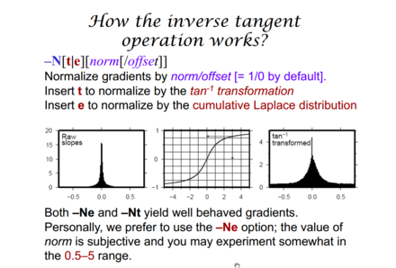
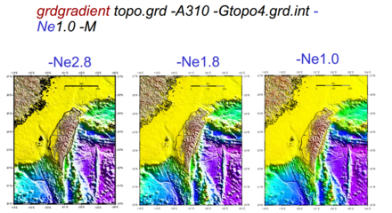
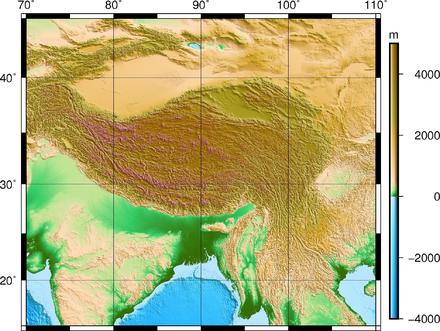
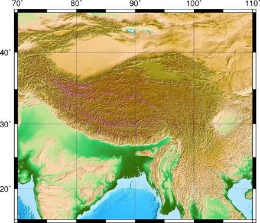
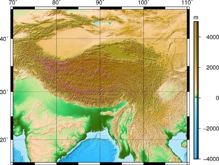
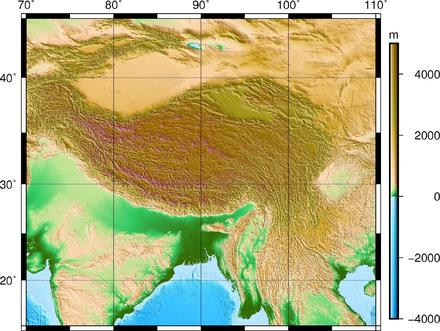

命令：  
> grdgradient HI_topo2.grd –A0 –Nt –GHI_topo2_int.grd

> Grdgradient制作梯度信息的网格文件，得到方向导数，输入文件为HI_topo2.grd，设置方向导数的方向为0°。  
> -Aazim1[/azim2]：求两个方向（**方向指从正北顺时针转过的角度**）的导数，保留较大的那个值。这在打算显示两个方向的照明是非常有用。  
> -N表示归一化，后面的t表示一种归一化算法，输出的文件为HI_topo2_int.grd.若不确定用什么，一般用e0.6（官网推荐）  

不同照明角度的影响：
1. A45
2. A135    

#### 奇怪之处
-D的用法：  
> -D[a][c][o][n]
Find the direction of the positive (up-slope) gradient of the data. To instead find the aspect (the down-slope direction), use -Da. By default, directions are measured clockwise from north, as azim in -A above. Append c to use conventional Cartesian angles measured counterclockwise from the positive x (east) direction. Append o to report orientations (0-180) rather than directions (0-360). Append n to add 90 degrees to all angles (e.g., to give local strikes of the surface ).  

-D是寻找坡度方向？但不可单用。
A135 -D与A45效果类似，而A45 -D与A135效果类似。

