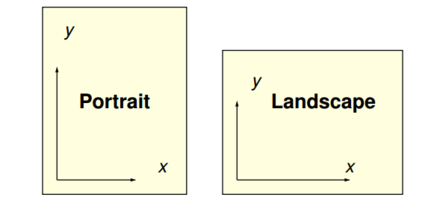

简单介绍参见：[GMT简介](https://www.jianshu.com/p/b6c0c8efbb90)  
下面主要介绍GMT绘图的一些基本概念

#### 1. 图层叠加
GMT绘图就是用一个个命令绘制一层层的图层，然后按顺序把图层叠加上去，成为最终效果。
如在地形图上绘制测线，是由grdimage绘制地形图，再由psxy绘制测线，叠加上去：


图中白色区域其实是透明的，所以叠加上去不会覆盖掉底层的图，  
**注意**叠加的顺序，如果先画测线再画地形，那么测线就会被地形覆盖住，但是先画地形，那么测线只会把地形上测线所在的区域覆盖！  
- **PS文件**：  
GMT默认输出的图件格式是.ps，即postscript矢量图，这种格式一般需要转为更通用的jpg等格式。
一般的GMT绘图脚本：
```sh
#!/bin/bash
#plot a profile from grd or plane
RR=R105/120/5/25
JJ=JM5i
JJP=JX8C/4.5C
PS=profile.ps
CPT=etopo1.cpt   
GRD=nanhai_topo.grd
ILLU=tmp.i
DAT=trac.dat

#gmt project -C$START -E$END -G10 -Q >$DAT 
#gmt nearneighbor -I1m -S5m -V $FI -G$GRD -$RR
#gmt grdgradient $GRD -A45 -Nt -G$ILLU 
gmt psxy -$JJ -$RR -T -K >$PS
gmt grdimage $GRD -$JJ -$RR -I$ILLU -C$CPT -K -O -P >>$PS 
gawk '{print $1,$2}' $DAT|gmt psxy -$JJ -$RR -B5 -BWnSe -W2p,red -K -O >>$PS
#gmt psscale -$JJ -$RR -DjRB+jLB+o0.5c/0c+w10c/0.3c -C$CPT -I  -G-4000/1000 -Bx1000 -By+l"m" -K -O >>$PS
#gmt psxy -Y12c $PRO_DAT -$JJP  -R$X_MIN/$X_MAX/$Y_MIN/$Y_MAX -Ba1000 -BSW -W2p --MAP_FRAME_TYPE=graph -K -O >>$PS
gmt psxy -$JJ -$RR -T -O >>$PS
gmt psconvert $PS -Tj -A 
```
#### 2. GMT的命令模式
1. 设计变量  
因为有些量经常用到，用变量代替的方式便于后面修改；  
变量赋值用： =    
调用变量用： \$变量名，即\$PS表示Li.ps  
``` sh
PS=Li.ps  #图名
#R代表经纬度范围，经度82-90度，纬度42-45度
RR=R82/90/42/45 
#J代表投影方式，即把球形投影到平面上的方式；
#M为墨卡托投影，18c表示全图长18cm，宽根据长宽比自动调整。
JJ=JM18c
#这是色彩文件，用来把地形数据映射为颜色，
#如多少米用哪种颜色表示，GMT自带了一些常用的cpt文件。
CPT=etopo1.cpt
GRD=Li_topo.grd#grd为网格数据，这里是地形数据
ILLU=topo.i#梯度数据，后面会讲到
TXT1=GPS_this.txt
TXT2=GPS_K.txt#两个GPS速度场
```
2. GMT模块调用（GMT命令组成模式）  
gmt 模块名 -参数+参数值  -参数+参数值 ... >输出文件  
模块相当于一个个独立的小程序。  
```sh
gmt grdimage input.grd  -JM18c -R82/90/42/45 -B2 > result.ps
```
> 上面的例子中：
> 每条命令前必须加gmt，意为调用GMT这个大程序     
> grdimage是模块名，用来把数据变成图形，   
> input.grd数输入数据，即绘图所需的网格数据  
> -J是参数，用来调整图形属性（把数据投影到平面），M18c是参数值。    
> -R是参数，用来确定绘图范围，82/90/42/45是参数值，   
> -B也是参数，2是参数值。   
> \>表示输出，result.ps是得到的图形，ps是一种图形格式。    
> 注意每个模块后面可以跟随很多的参数。

#### 3. 参数（也可以叫做选项）
由于每个模块后面可以有很多参数，而这些参数分为通用参数和专用参数。  
1. 通用参数：即所有模块都可以或者说都需要使用的参数
2. 专用参数：只有特定模块可以使用，基本每个模块都有自己的专用参数  
- **介绍一些比较常用的通用参数**
1. -K与-O  
由前面可知，GMT绘图时图层叠加，那GMT是如何知道哪几个命令的输出叠加到一张图上而不是输出到几张图呢？就是通过-K与-O。且这两个选项有特殊的规定：  
a)第一个图层用-K,输出用>  
b)第二个图层用-K -O， 并且输出用>>而不是>  
c)最后一个图层用-O，输出用>>  
d)若第二层就是最后一层，只需要-O，输出用>>
e)若只有一个图层，-K与-O都不需要, 输出用>
范例见脚本一。  
由于我们经常要修改模块及其参数，有时候会忘记修改-K与-O或不小心删除它们（实际上这是我也常犯的错误），所以一个好的脚本编写模式是：  
```sh
gmt psxy -$JJ -$RR -T -K >$PS
#这里编写具体绘图命令
gmt psxy -$JJ -$RR -T -O >>$PS
```
pxy 后面跟上-T表示什么也不做（-J和-R是必选项），这样就不会动这两行，也就不容易出错了。
2. -J  
-J表示投影。  
由于GMT经常用于地理绘图，所以需要考虑投影方式。因为地理数据都是在球状地球上得到的，如果把这些数据投影到2D平面上（如把极地附近的投影到平面），而不至于变形太严重。  
最常见的是笛卡尔投影，直接把经纬度投影成矩形，但这样高纬度（如极地）地区变形非常严重。  
前人已经提出了很多投影方法，有适合低纬度的，也有适合高纬度的。
3. -R  
每一幅图像都有一个范围，x轴和y轴方向都是有限的，在GMT中这个范围需要我们手动输入。  
其实GMT也提供了命令直接从输入数据中提取范围，参见：[gmtinfo 与 grdindo](https://www.jianshu.com/p/2dae33e3a836)  
4. -P   
-P是改变画板的摆放方式。



GMT默认的画板是A4纸张大小，但是它的摆放方式是landscape（图右），可能我们更希望是正常的A4摆放方式，加入-P，摆放方式就变为portrait模式了。  
所以标准的脚本编写方式是：
```sh
#/*************************************************************************
#	> File Name: test.sh
#	> Author:PengZhong 
#	> Mail: 
#	> Created Time: Mon Nov  5 19:24:28 2018
# ************************************************************************/

#!/bin/bash
PS=out.ps
GRD=input.grd
JJ=JM8c
RR=R10/20/15/35

gmt psxy -$JJ -$RR -T -K -P >$PS
#这里编写具体绘图命令
gmt psxy -$JJ -$RR -T -O >>$PS
gmt psconvert $GRD -Tj -A -E300

```
psconvert是把ps文件转换为通用的jpg，png等图片格式。参见：[psconvert图片格式转换](https://www.jianshu.com/p/913b52b99001)

- **特定参数**
与每个模块相关
- **必选参数和可选参数**
对于每个模块来说，有的参数是必须添加进来才能正常运行，而有些参数是更加精细的调整参数，可以不用。如对于grdimage模块来说，input.grd和-J与-R都是必选参数，-B是可选参数。