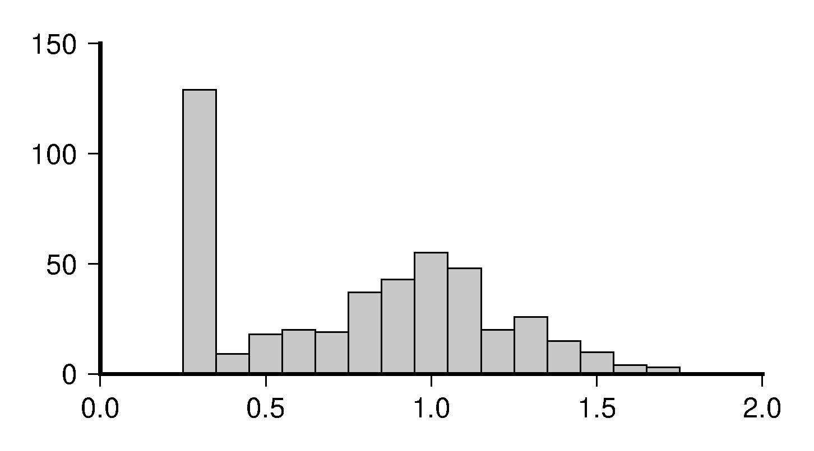

#### 命令：pshistogram

```sh
#!/bin/bash
 
FI=A_filter_0.1.txt
PS=A_histogram.ps
JJ=-JX10c/5c
gawk '{print $NF}' $FI|gmt pshistogram $JJ -W0.1 -G200 -L0.5p -BSW -Ba -F -P >$PS
gmt psconvert $PS -A0.5c -Tj
rm  gmt.* $PS
```
#### 解释
pshistogram是把一列数据画成直方图（分布函数）。  
- -W：分割数据区间的大小，后面跟的number即是每一个柱体对应的宽度，这里是0.1，即每个柱体代表x-x+0.1的数量（x是任意一个数）。
- -G：柱体填充的颜色，果为0~255的数，则为灰度图，0为黑色，255为白色，200的浅灰色比较不错。
- -L：柱体轮廓线的粗细，默认没有轮廓线
- -F：X轴的标识居中，默认居左
- -R



