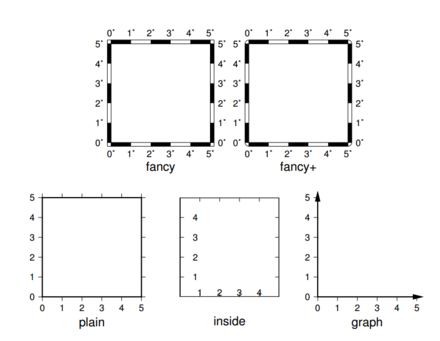

命令：  
> gmt gmtset MAP_FRAME_TYPE plain

MAP_FRAME_TYPE 底图边框类型 [fancy]  

可选值包括 inside|plain|graph|fancy|fancy+ 。一般情况下， fancy 边框类型仅适用于投影后

的 X、 Y 方向平行于经度纬度方向的情况下，比如 rectangular 投影、 polar 投影。对于某些投影，

只能使用 plain 底图，即便 MAP_BASEMAP_TYPE 被设置为 fancy。

**更多资料**  
[GMT目录](https://www.jianshu.com/p/321f67983c42)
