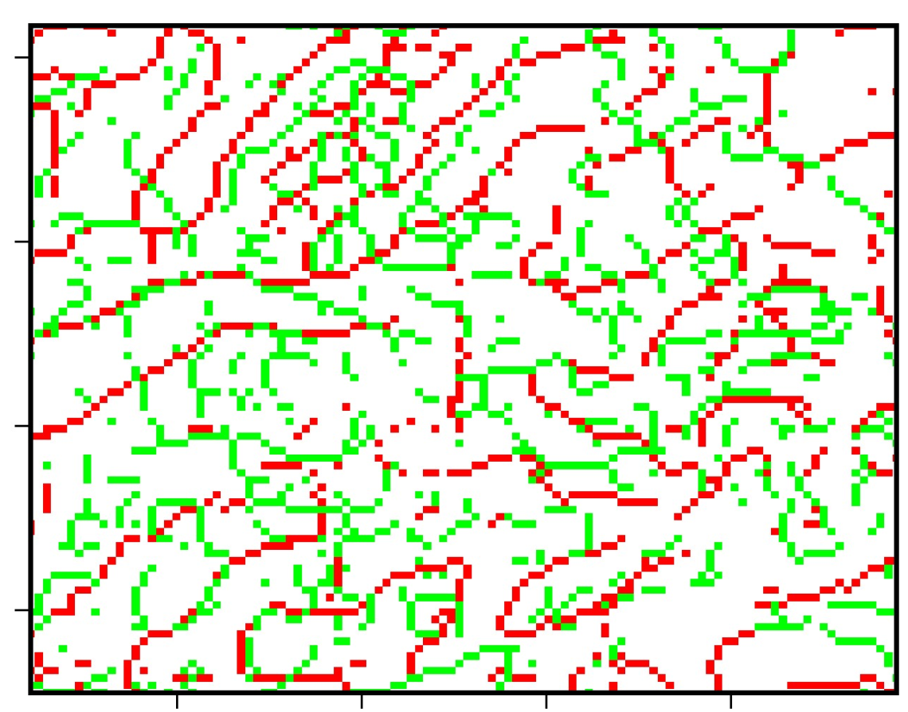

### Question
if  you have more than one grd data to plot at one figure, you may need know this trick.  
there are three steps:
1. gridding your data
2. set 0 or other special value to NAN
3. force NAN to be transparent

### code
```sh
# first step 
gmt xyz2grd $TXT $RR -I0.022d/0.02d  -G$GRD
# second step, the key is +n0, which make 0 to be flaged as NaN
gmt grdconvert $GRD2 -Gtmp.grd=nb+n0
# third step, -Q force NAN to be transparent
gmt grdimage $JJ $RR tmp.grd  -C$CPT2 -Q -K -O >>$P
```
#### example 
plot two edges on one figure.    

