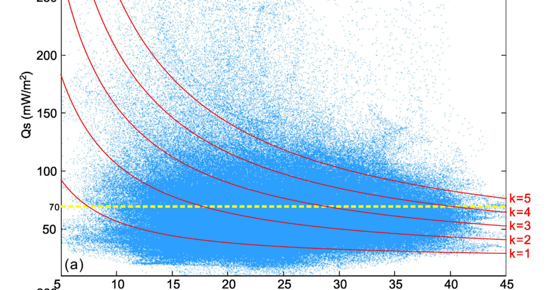
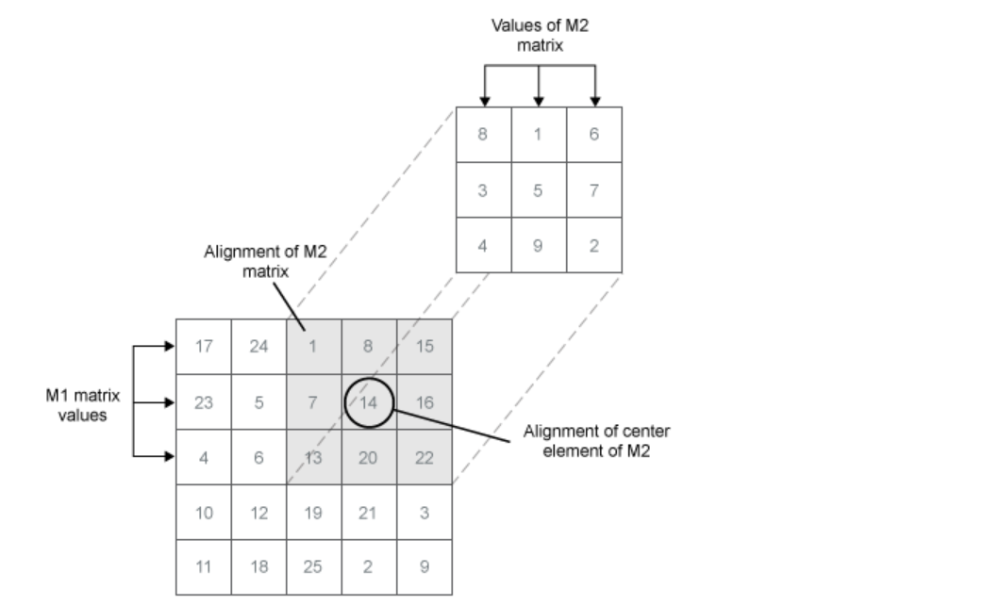

## How to get correlation betwwen 2D signal

### statistic correlation

  
just statistic the result of two elements, ignore their relative postion.

### 2D Cross Correaltion
#### Matlab function: xcorr2(m1,m2)
m1 and m2 are tow 2D arrays, and function xcorr2 can compute their cross correlation and give position of their strong correlation .(I have tried to practise and succeed)  



#### e.g.  
```matlab
M1=[1,2,3
	4,5,6
	7,8,9];
M2=[1,2
	8,9]
D= xcorr2(M1,M2)
D=[ 9    26    43    24
    38    82   102    51
    71   142   162    78
    14    23    26     9]
D(3,3)=162=1*5+2*6+8*9+8*9;
```
